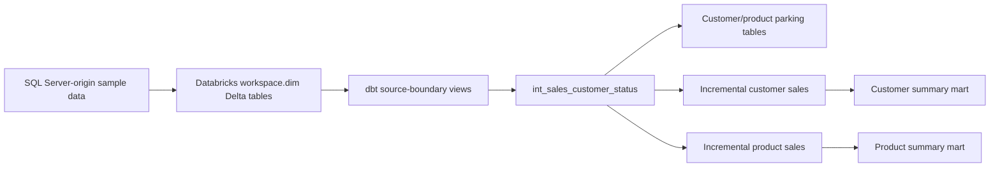
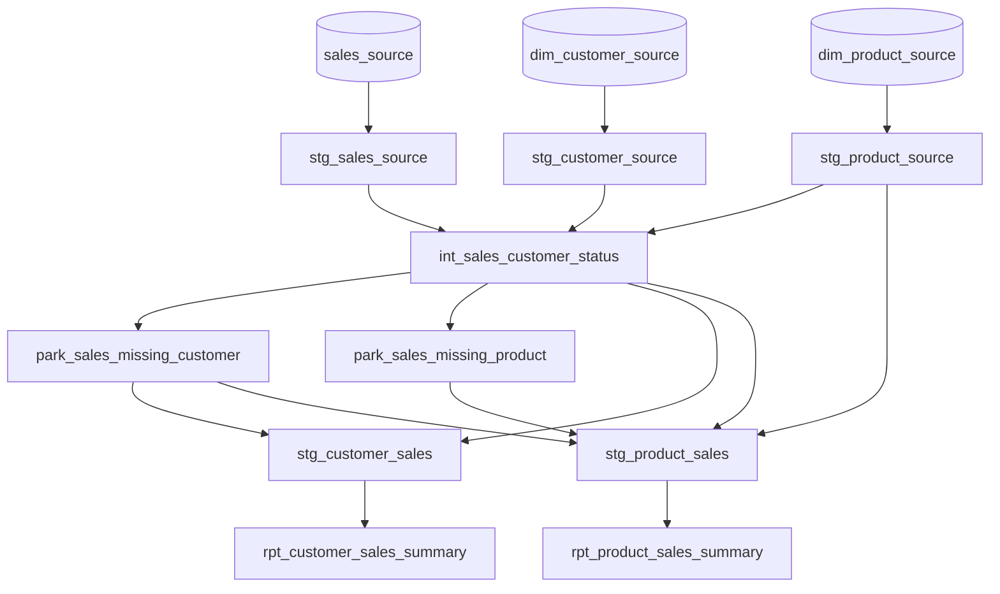
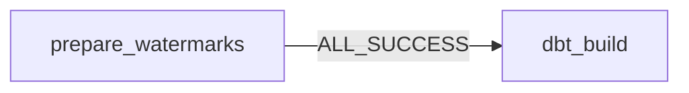
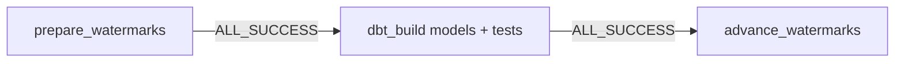

# Project Context: Pentaho to Databricks with dbt

Last consolidated: 2026-08-29

This document is a development handoff for another developer or Codex session. It consolidates repository evidence and important decisions from the working conversation. It is not a replacement for inspecting the code.

Evidence labels used below:

- **CONFIRMED FROM CODE**: present in the current repository.
- **CONFIRMED IN DATABRICKS / CONVERSATION**: implemented or observed in the workspace during this project, but not necessarily represented as code in the repository.
- **DECIDED IN CONVERSATION**: an agreed design requirement that may still be unfinished.
- **PLANNED / NOT IMPLEMENTED**: recorded work that has not been completed.
- **ASSUMPTION / NEEDS VERIFICATION**: likely true, but the next developer must verify it before relying on it.

## 1. Project Overview

### Purpose

**CONFIRMED FROM CODE:** This is a learning and reference migration project for converting several Pentaho ETL pipelines into a single dbt project running against Databricks. The Pentaho KJB/KTR files for the first example act primarily as orchestration wrappers; the important transformation behavior came from SQL Server stored procedures.

The implemented reference conversion is Project 1, based on the behavior of `etl.usp_run_incremental_sales_etl`. It transforms sales and lookup data into:

- standardized source-boundary views;
- customer and product validation;
- persistent parking tables for missing lookup records;
- incrementally merged customer- and product-enriched sales tables;
- customer and product reporting summaries;
- dbt schema and business-rule tests.

### Business and learning goals

- Demonstrate how to decompose a procedural Pentaho/SQL Server ETL into declarative dbt models.
- Preserve incremental processing and late-arriving lookup recovery.
- Use Databricks Workflow orchestration for bounded, source-specific watermark windows.
- Keep unchanged enriched-sales records out of incremental merges so their `loaded_at` values do not change unnecessarily.
- Provide a repeatable pattern that can later be applied to five additional Pentaho project areas.

### Intended users

- Data engineers learning or performing Pentaho-to-dbt migrations.
- Developers maintaining dbt on Databricks.
- Reviewers comparing legacy stored-procedure output with dbt output.

There is no frontend or end-user web application in this repository.

### Current development stage

**CONFIRMED FROM CODE:** Project 1 models and tests are implemented. Source setup scripts, a recovery snapshot, documentation, a job-compatible dbt profile, and `prepare_watermarks` notebook exist.

**CONFIRMED IN DATABRICKS / CONVERSATION:** A Databricks job named `pentaho_project_1_incremental` exists with working `prepare_watermarks` and native `dbt_build` tasks. Verification run `721943511175993` completed both tasks successfully.

**PLANNED / NOT IMPLEMENTED:** The workflow is not complete. Both watermark notebooks exist; the immediate next deliverable is Step 16.9, configuring `advance_watermarks` as a success-only job task, followed by retry/failure validation and a production trigger.

### Major implemented features

- Five SQL Server-origin source declarations.
- Nine Project 1 dbt models.
- Customer and product exception parking/recovery.
- Source-specific selective incremental enrichment.
- Customer and product summary marts.
- Generic and singular data tests.
- Controlled baseline and second-snapshot Databricks SQL data.
- Git-backed Databricks workflow preparation and dbt execution.

### Major planned features

- Safe advancement of source watermarks after successful dbt completion.
- Full workflow success, failure, retry, and repair-run verification.
- Production schedule/trigger and notifications.
- Optional experiment invoking dbt from a Python notebook.
- Version-controlled job definition using Databricks Declarative Automation Bundles.
- Future conversion work under `pentaho_project_2` through `pentaho_project_6`.

## 2. Technology Stack

### Core technologies

| Area | Technology | Status / version |
|---|---|---|
| Transformation | dbt Core with `dbt-databricks` | Repository dependency is currently unpinned; Databricks job pins `dbt-databricks==1.12.4`. Job logs reported dbt Core `1.12.0`. |
| SQL dialect | Databricks SQL / Spark SQL | Used by all dbt models and setup scripts. |
| Database/lakehouse | Databricks with Unity Catalog and Delta tables | Catalog is `workspace`; project uses Free Edition serverless resources. |
| Source DDL reference | Microsoft SQL Server T-SQL | Stored under `docs/sql_db_script/source/`; not executed directly in Databricks. |
| Notebook language | Python / PySpark | `databricks/notebooks/prepare_watermarks.py`. |
| Configuration | YAML and Jinja | dbt project, profiles, source/model tests, schema generation. |
| Orchestration | Databricks Lakeflow Jobs / Workflows | Partially implemented in the Databricks workspace. |
| Version control | Git / GitHub | Remote is `https://github.com/jahirhstu/pentaho-to-dbt.git`; current branch is `main`. |
| Package management | Python `pip` and `requirements.txt` | No Node, frontend, CSS, or JavaScript package manager. |

### Authentication

- **Local dbt:** `DATABRICKS_HOST`, `DATABRICKS_HTTP_PATH`, and `DATABRICKS_TOKEN` environment variables.
- **Databricks dbt job:** Databricks injects `DBT_ACCESS_TOKEN` for the job's Run-as principal; the repository contains no workflow token literal.
- **Git:** configured in the Databricks job to read the GitHub repository.

### Hosting and deployment

- Models execute in Databricks against a SQL warehouse.
- Workflow tasks use Databricks serverless job compute compatible with Free Edition.
- The workflow is currently configured manually/API-side in the Databricks workspace.
- **PLANNED:** Step 18 will manage the complete job with Databricks Declarative Automation Bundles.

### Third-party libraries

- `dbt-databricks`; no dbt packages are currently declared (`packages.yml` contains an empty package list).
- PySpark APIs supplied by Databricks notebooks.

### Development tools

- Python virtual environment.
- dbt CLI commands: `debug`, `parse`, `compile`, `list`, `run`, `build`, `test`, `docs`, and `clean`.
- Databricks SQL Editor for setup and inspection.
- Databricks Jobs UI/API for workflow configuration and run monitoring.

## 3. Repository / Codebase Structure

```text
.
├── dbt_project.yml                  # dbt paths, tags, schemas, materializations
├── profiles.yml                     # tracked local/job profile; contains workspace-specific non-token settings
├── profiles.example.yml             # safe profile template
├── requirements.txt                 # Python dependency declaration
├── packages.yml                     # dbt packages; currently empty
├── macros/
│   └── generate_schema_name.sql     # target_schema + custom_schema naming
├── models/
│   ├── sources/
│   │   └── sql_server_sources.yml   # five Unity Catalog source tables and tests
│   ├── pentaho_project_1/
│   │   ├── staging/                 # source-boundary cleanup views
│   │   ├── intermediate/            # validation, parking, enriched sales
│   │   ├── marts/                   # customer/product summaries
│   │   └── pentaho_project_1.yml    # model documentation and generic tests
│   ├── pentaho_project_2..6/        # placeholders for future conversions
│   └── shared/                      # placeholder for reusable models
├── tests/                            # four singular business/reconciliation tests
├── databricks/notebooks/
│   └── prepare_watermarks.py        # fixed source-window capture and task values
└── docs/
    ├── steps.txt                    # authoritative implementation tracker/backlog
    ├── migration_guide.md           # source analysis and design rationale
    ├── model_tests_runbook.md       # test execution and interpretation
    ├── dbt_command_cheat_sheet.md   # project commands
    └── sql_db_script/
        ├── source/                  # original SQL Server source/control DDL
        ├── databricks/              # baseline and second-snapshot Delta data scripts
        ├── parking/                 # legacy/reference SQL
        └── report/                  # legacy/reference SQL
```

Generated directories such as `target/`, `logs/`, and `dbt_packages/` are ignored and must not be treated as source code.

The `.env` file is local and ignored. Never print or commit it.

## 4. Architecture

### End-to-end data flow



### dbt model graph



### Workflow architecture

Current:



Planned completion:



`prepare_watermarks` reads the last successful source-specific watermarks, captures each source's fixed maximum, and publishes six task values. `dbt_build` processes the fixed windows. `advance_watermarks` must persist exactly the captured ends only after all models and tests succeed.

### Schema naming

`generate_schema_name.sql` concatenates the target schema and custom schema. With target schema `dbt_dev`, expected relations include:

- `workspace.dbt_dev_staging`: source cleanup views plus incremental `stg_customer_sales` and `stg_product_sales` tables.
- `workspace.dbt_dev_intermediate`: `int_sales_customer_status` view.
- `workspace.dbt_dev_parking`: incremental customer/product parking tables.
- `workspace.dbt_dev_marts`: customer/product summary tables.

Folder location does not alone determine the final schema or materialization. Model-level `config()` overrides project defaults. This is why the two `stg_*_sales` files live under `intermediate/` but materialize as incremental tables in `dbt_dev_staging`.

### Application/frontend/backend/authentication

There is no frontend, HTTP API, route structure, UI component system, tenant model, or application authentication flow. Authentication concerns are limited to Databricks and Git credentials.

## 5. Database Model

### External/source tables in `workspace.dim`

The authoritative column shapes are the Databricks setup script and source YAML; the SQL Server DDL documents origin types.

#### `sales_source`

- Primary/business key: `sales_id`.
- Columns: `sales_id`, `order_number`, `customer_id`, `product_id`, `store_id`, `sales_date`, `quantity`, `unit_price`, `discount_amount`, `source_updated_at`.
- Logical references: customer, product, and store IDs.
- `source_updated_at` drives the sales watermark.

#### `dim_customer_source`

- Key: `customer_id`; `customer_code` is also expected unique after staging.
- Columns: customer code/name/email, `region_id`, `is_active`, and `source_updated_at`.
- `source_updated_at` drives the customer watermark.

#### `dim_product_source`

- Key: `product_id`; `product_code` is also expected unique after staging.
- Columns: product code/name/category/current unit price, `is_active`, and `source_updated_at`.
- `source_updated_at` drives the product watermark.

#### `dim_store_source`

- Key: `store_id`; references `region_id`.
- Used by relationship tests for product-enriched sales.

#### `dim_region_source`

- Key: `region_id`.
- Used by customer relationship tests.

### dbt-owned state and outputs

#### Parking tables

`park_sales_missing_customer` and `park_sales_missing_product` are incremental Delta tables keyed by `sales_id`. They retain the sale attributes plus:

- `rejection_reason`;
- `parked_at`;
- `is_resolved`;
- `resolved_at`.

There is deliberately no legacy identity `park_id` or `etl_run_id`.

#### Enriched sales tables

`stg_customer_sales` is keyed by `sales_id` and contains customer information, calculated `sales_amount`, source timestamp, and `loaded_at`.

`stg_product_sales` is keyed by `sales_id` and contains product information, store, calculated amount, source timestamp, and `loaded_at`.

#### Summary marts

- `rpt_customer_sales_summary`: one row per `customer_id` with count, quantity, amount, first/last dates, and `updated_at`.
- `rpt_product_sales_summary`: one row per `product_id` with equivalent aggregates.

These marts are fully recalculated tables, not incremental models.

### Watermark control table

**CONFIRMED IN DATABRICKS / CONVERSATION:** `workspace.etl.dbt_source_watermarks` exists with one row for each of `sales`, `customer`, and `product` under pipeline `pentaho_project_1`. Required columns used by code are:

- `pipeline_name`;
- `source_name`;
- `last_successful_watermark`.

**NEEDS VERIFICATION:** The control-table DDL is not checked into the repository. Inspect `DESCRIBE TABLE workspace.etl.dbt_source_watermarks` before extending it or depending on audit columns.

### Constraints and permissions

- Generic dbt tests enforce key uniqueness, non-null columns, relationships, and accepted values.
- Delta DDL declares `NOT NULL`; primary-key semantics are primarily validated with dbt tests.
- No row-level security implementation exists in the repository.
- The workflow Run-as principal needs catalog/schema use, source reads, target writes, control-table reads/writes, and SQL warehouse use.

## 6. Current Features and Their Implementation

### Source cleanup

Files: `models/pentaho_project_1/staging/*.sql`.

- Cast source identifiers and values into stable Databricks types.
- Trim names/categories, lowercase customer email, and normalize timestamps.
- Materialized as lightweight views.

### Customer/product validation

File: `models/pentaho_project_1/intermediate/int_sales_customer_status.sql`.

- Left joins sales to customer and product lookups.
- Preserves every sale.
- Adds `is_missing_customer` and `is_missing_product` flags.

### Stateful parking and recovery

Files: `park_sales_missing_customer.sql` and `park_sales_missing_product.sql`.

- First appearance without a lookup creates a parking row.
- Incremental runs read `{{ this }}` to preserve `parked_at`.
- When the lookup arrives, the existing row becomes resolved and gains `resolved_at`.
- Full refresh discards prior parking history; normal incremental runs preserve it.

### Selective incremental customer sales

File: `stg_customer_sales.sql`.

- Affected sales are the union of directly changed sales, sales belonging to changed customers, and customer-parking recoveries.
- Only affected, valid-customer sales enter the merge.
- `loaded_at` changes only for inserted/updated affected rows.

### Selective incremental product sales

File: `stg_product_sales.sql`.

- Affected sales include direct sales changes, customer changes, product changes, customer recoveries, and product recoveries.
- Missing-customer and missing-product sales are excluded.
- Only affected rows enter the merge.

### Reporting marts

Files: `models/pentaho_project_1/marts/*.sql`.

- Rebuild current lifetime aggregates from the enriched sales tables.
- Customer and product summaries intentionally use `current_timestamp()` for mart `updated_at` on every rebuild.

### Testing

Generic tests live in `pentaho_project_1.yml` and `sql_server_sources.yml`. Singular tests verify:

- positive/nonnegative sales inputs and valid discount amount;
- parking resolution timestamp consistency;
- exact reconciliation of customer summaries with customer sales;
- exact reconciliation of product summaries with product sales.

A data test passes by returning zero rows.

### Workflow watermark preparation

File: `databricks/notebooks/prepare_watermarks.py`.

- Validates `pipeline_name` syntax.
- Requires exactly one non-null control value for sales/customer/product.
- Captures the maximum source timestamps in UTC.
- Uses the start value for an empty source, creating an empty window.
- Rejects a source maximum earlier than the persisted start.
- Publishes six ISO-8601 task values.

### Native Databricks dbt task

**CONFIRMED IN DATABRICKS / CONVERSATION:** The task:

- is Git-backed to this repository's `main` branch;
- depends on `prepare_watermarks` with `ALL_SUCCESS`;
- uses serverless environment version `2`;
- pins `dbt-databricks==1.12.4`;
- runs against the configured SQL warehouse and `workspace`/`dbt_dev` namespace;
- executes `dbt build --profiles-dir . --target job --select pentaho_project_1` with all six dynamic task-value variables.

The task definition itself is not stored in this repository yet.

## 7. Important Decisions We Made

### Decompose procedures instead of translating line by line

- **Decision:** Split stored-procedure logic into staging, intermediate, parking, and mart models.
- **Why:** Produces a testable dependency graph and reusable datasets.
- **Implication:** Preserve business behavior, not procedural statement order.

### Pentaho orchestration becomes Databricks Workflow orchestration

- **Decision:** KJB/KTR wrappers are not modeled as dbt SQL.
- **Why:** They contain no important transformation logic for Project 1.
- **Alternative:** Reproduce every Pentaho step mechanically; rejected as unnecessary.

### dbt owns parking tables

- **Decision:** Parking is an incremental dbt model, not both a `source()` and a model.
- **Why:** Avoids treating one relation as externally owned and dbt-owned simultaneously.

### Replace the legacy run-control design

- **Decision:** Do not reproduce SQL Server `etl.etl_run_control` as-is.
- **Why:** dbt artifacts and Databricks job metadata handle run status/errors; a focused control table handles source watermarks.
- **Implication:** Legacy counts and identity-based run records are not part of current dbt models.

### Use source-specific bounded watermarks

- **Decision:** Capture independent sales, customer, and product windows using `start < source_updated_at <= end`.
- **Why:** Lookup changes can affect old sales even when the sales row did not change.
- **Clarification:** The three sources do not share identical timestamps. All models receive the same immutable set of six source-specific values for one workflow run.

### Capture fixed ends before dbt runs

- **Decision:** `prepare_watermarks` calculates the ends once and publishes task values.
- **Why:** Prevents models in one run from observing different moving maxima and makes repair runs repeatable.
- **Alternative:** Each model queries the control/source tables for the latest maximum; rejected because it weakens run-boundary consistency and can cause gaps if the committed watermark advances beyond what every model processed.

### Advance only after models and tests succeed

- **Decision:** The future `advance_watermarks` task depends on `dbt_build` with `ALL_SUCCESS` and writes the exact captured ends.
- **Why:** A failed model/test must not mark data as processed.
- **Status:** Planned, not implemented.

### Select affected sales, without target comparison or row hashes

- **Decision:** Incremental models identify affected IDs from source/lookup windows; they do not compare calculated rows to targets and do not compute row hashes.
- **Why:** This was the selected “option 4” balance for a realistic large-data approach without the requested refinements.
- **Implication:** A source row timestamped inside the window is merged even if selected business values did not change.

### Use native Databricks dbt task as the current baseline

- **Decision:** Use the native task rather than a custom Python notebook to run dbt.
- **Why:** Better built-in artifacts, logging, and simpler orchestration.
- **Alternative:** Step 17 records a future notebook-runner experiment, but it must not replace the native task without equivalent validation.

### Use `--profiles-dir . --target job`

- **Decision:** Force dbt to use the Git checkout's `profiles.yml`.
- **Why:** Databricks generated a profile containing only `databricks_cluster`, causing `--target job` to fail.

### Pin the adapter and use serverless environment version 2

- **Decision:** Pin `dbt-databricks==1.12.4` for the job and use environment version 2.
- **Why:** Reproducibility and Free Edition compatibility. Deprecated `Client-1` failed to launch.

### Keep marts as full tables

- **Decision:** Recalculate complete current summaries.
- **Why:** Simpler and reliable at current scale; avoids maintaining affected aggregate keys.
- **Future:** Optimize only after validated need.

## 8. Coding Conventions and Project Rules

Instructions for future work:

- Use lowercase snake_case for dbt resources, columns, variables, and task keys.
- Use `source()` only for externally supplied tables and `ref()` for dbt-owned dependencies.
- Keep one-to-one cleanup in staging, reusable joins/business rules in intermediate, and reporting outputs in marts.
- Add `depends_on` comments where conditional Jinja hides a dependency from dbt parsing.
- Prefer explicit casts at source boundaries.
- Use Delta incremental `merge` with a reliable `unique_key`.
- Use UTC for workflow watermark timestamps and ISO-8601 strings.
- Keep watermark intervals half-open/closed: `start < timestamp <= end`.
- Do not recalculate watermark ends in `advance_watermarks`.
- Never advance control state after a failed model or test.
- Do not run competing dbt tasks concurrently against the same target tables.
- Preserve user changes in a dirty worktree; inspect before editing.
- Never commit `.env`, tokens, credentials, proprietary production data, or local vault/editor files.
- Use anonymized `.test` email addresses and controlled sample data.
- Run `dbt parse` after structural edits and `dbt build`/tests when Databricks credentials are available.
- Use `dbt build`, not just `dbt run`, for workflow execution because tests are part of the success contract.
- Do not use `--full-refresh` for the normal recovery snapshot because it destroys incremental parking history.
- Update `docs/steps.txt` only when completion is demonstrated; distinguish `Done locally` from workspace completion.

There are no TypeScript, component, API, UI styling, tenant, or role conventions because those layers do not exist.

## 9. Important Business Rules

1. **Sales amount:** `(quantity * unit_price) - discount_amount`, cast to `DECIMAL(12,2)` in enriched sales.
2. **Input validity:** quantity must be positive; prices and discounts cannot be negative; discount cannot exceed gross amount.
3. **Missing customer:** keep the sale visible in validation, park it, and exclude it from both enriched-sales outputs until recovery.
4. **Missing product:** keep the sale in customer sales, park it for product recovery, and exclude it from product sales until recovery.
5. **Late-arriving lookup:** a customer/product arriving within its lookup watermark window must make related old sales eligible even if those sales have no new sales timestamp.
6. **Parking history:** preserve original `parked_at`; set `resolved_at` once when lookup becomes available; unresolved rows have null `resolved_at`.
7. **Inactive lookups:** `is_active` is standardized and tested as boolean, but current model logic does not filter inactive customers or products. Do not add such a filter without a new business decision.
8. **Incremental timestamp contract:** source systems must update `source_updated_at` reliably when relevant values change.
9. **Fixed run contract:** one run uses one immutable set of six source-specific watermark values.
10. **Control advancement:** commit the three ends only after the complete dbt build and tests succeed.
11. **Enriched `loaded_at`:** unchanged sales should retain prior values; only affected merge input rows receive a new timestamp.
12. **Mart timestamps:** summary tables rebuild, so their `updated_at` values change on each build.
13. **Window equality:** `start == end` is a valid empty source window.

## 10. Current State of Development

### Fully working

- Project 1 source declarations, models, and tests.
- Baseline and second-snapshot data scripts.
- Local Databricks profile pattern.
- Selective incremental logic using six required vars.
- `prepare_watermarks` notebook.
- Databricks `prepare_watermarks -> dbt_build` workflow path.
- Successful two-task verification run.

### Partially implemented

- Step 16 orchestration. It calculates and uses windows but does not yet advance them automatically.
- Operational configuration exists in Databricks but is not captured as infrastructure-as-code.

### Started but unfinished

- `docs/steps.txt` contains detailed Step 16–18 plans.
- Step 16.8 is implemented in `databricks/notebooks/advance_watermarks.py`; its Databricks task configuration remains Step 16.9.

### Not implemented

- `advance_watermarks` notebook/task.
- Controlled success/failure/repair validation for the complete three-task workflow.
- Production trigger, overlap prevention, and notifications.
- Notebook-based dbt runner experiment.
- Databricks bundle.
- Projects 2–6 conversions.

### Technical debt / discrepancies

- `requirements.txt` does not pin `dbt-databricks`, although the workflow does.
- The watermark control-table DDL is absent from Git.
- The actual Databricks job definition is absent from Git.
- `profiles.yml` is tracked and contains workspace-specific host/warehouse configuration. It contains no literal token, but future environment parameterization would be cleaner.
- `README.md` still describes an early raw-table example and is less current than `docs/steps.txt` and `migration_guide.md`.
- Project 1's parking-resolution singular test currently checks only customer parking; product parking relies on generic tests and should be considered for equivalent singular coverage.
- Local dbt in the last observed shell reported a `dbt-fusion` preview rather than the workflow's dbt Core version; local/workflow parity needs verification before relying on local execution behavior.

### Worktree state at handoff creation

**CONFIRMED FROM CODE:** `docs/steps.txt` has uncommitted changes relative to `origin/main`. `PROJECT_CONTEXT.md` is newly added by this handoff task. Preserve and review these changes before committing.

## 11. Outstanding Tasks / Backlog

### High Priority

1. **Implement Step 16.9:** configure `advance_watermarks` after `dbt_build` with `ALL_SUCCESS`, passing the original task values from `prepare_watermarks`.
2. **Complete Step 16.10:** review and understand both watermark notebooks line by line, including their shared data contract and safety checks.
3. **Implement Step 16.11:** add limited dbt retries and document Repair run selection so preparation is not rerun during repair.
4. **Verify Step 16.12:** run the complete workflow, compare task ends to committed control values, inspect dbt artifacts/tests, and prove unchanged enriched rows retain `loaded_at`.
5. **Verify Step 16.13:** controlled failure on a disposable branch; confirm advancement is skipped and control values remain unchanged; repair with the original window.

### Medium Priority

1. Add production trigger/timezone, maximum-concurrency protection, and notifications after validation.
2. Check in the watermark control-table creation/bootstrap SQL.
3. Pin the local dependency to a tested adapter version and document compatibility with the workflow version.
4. Update README to reflect the implemented Project 1 and workflow.
5. Add equivalent product-parking resolution business test if desired.

### Later / Nice to Have

1. Step 17: compare a Python-notebook dbt runner with the native task.
2. Step 18: store the complete job as a Databricks Declarative Automation Bundle.
3. Convert Projects 2–6 after collecting their Pentaho and procedure inputs.
4. Consider incremental marts only after volume/performance evidence warrants complexity.

## 12. Known Problems and Debugging History

### Databricks MERGE rejected column aliases after `VALUES`

- **Symptom:** `[COLUMN_ALIASES_NOT_ALLOWED] Column aliases are not allowed in MERGE` for `USING (VALUES (...)) AS source (columns...)`.
- **Root cause:** The Databricks SQL form used did not accept that alias declaration in `MERGE`.
- **Resolution:** Use `USING (SELECT CAST(...) AS column, ...)` and `UNION ALL` for multiple rows. The second-snapshot script uses this form.
- **Status:** Resolved.

### Models in an `intermediate` folder appeared as staging tables

- **Symptom:** `stg_customer_sales` and `stg_product_sales` appeared under `dbt_dev_staging` as tables even though files are under `intermediate/` and project defaults mention views.
- **Root cause:** Each model explicitly sets `schema='staging'` and `materialized='incremental'`; model-level config overrides folder defaults. Incremental relations are tables.
- **Status:** Expected behavior, not a bug.

### All `loaded_at` values changed

- **Symptom:** Every enriched row showed the same new `loaded_at` after an incremental execution.
- **Root cause:** Earlier model logic fed the complete valid dataset to the merge, so all matched rows were updated.
- **Resolution:** Step 15 added affected-sales selection based on sales/customer/product windows and recovery sets. No target comparison or row hash was added by explicit decision.
- **Status:** Resolved in model code; full workflow validation remains Step 16.12.

### `SELECT *` did not visibly show sale 5007, but filtered query did

- **Symptom:** Unfiltered Databricks result view appeared not to contain `sales_id=5007`; `WHERE sales_id IN (5001,5007)` returned it.
- **Likely cause:** Result pagination, ordering, UI caching, or limited displayed rows; SQL tables have no guaranteed order without `ORDER BY`.
- **Workaround:** Query with `WHERE`, `ORDER BY`, and explicit counts/min/max when verifying data.
- **Status:** No underlying missing record was demonstrated.

### Serverless `Client-1` launch failure

- **Symptom:** `Invalid platform channel Client-1` / workspace does not support Client-1 for REPL.
- **Root cause:** Deprecated/incompatible serverless environment configuration in Free Edition.
- **Resolution:** Replace `client: "1"` with `environment_version: "2"`.
- **Status:** Resolved.

### dbt job could not find target `job`

- **Symptom:** dbt said profile `pentaho_to_databricks` only had target `databricks_cluster`.
- **Root cause:** Native Databricks dbt task supplied its generated profile instead of the repository profile.
- **Resolution:** Add `--profiles-dir . --target job` to the dbt command.
- **Status:** Resolved.

### First orchestration verification failures

- First failure happened before dbt due to Client-1.
- Second failure reached dbt but selected the generated profile.
- After both fixes, run `721943511175993` succeeded for `prepare_watermarks` and `dbt_build`.

## 13. Setup Instructions

### Prerequisites

- Git.
- Python 3 and `venv`.
- A Databricks workspace with Unity Catalog and SQL warehouse access; this project used Free Edition.
- A Databricks personal access token for local dbt, obtained separately.

### Local installation

```bash
git clone https://github.com/jahirhstu/pentaho-to-dbt.git
cd pentaho-to-dbt
python3 -m venv .venv
source .venv/bin/activate
python -m pip install -r requirements.txt
dbt --version
```

### Environment setup

Export the required variables in the shell or use an ignored local `.env` with an appropriate loader:

```bash
export DATABRICKS_HOST=<required-workspace-host>
export DATABRICKS_HTTP_PATH=<required-sql-warehouse-http-path>
export DATABRICKS_TOKEN=<secret-obtain-separately>
```

Use `profiles.example.yml` as the safe template. `profiles.yml` in the repository already defines `dev` and `job`; verify workspace-specific values before use.

### Database/sample setup

1. In Databricks SQL Editor, run `docs/sql_db_script/databricks/initial_source_data.sql`.
2. Verify expected source counts: regions 2, stores 2, customers 3, products 2, sales 6.
3. For a controlled initial build, provide a valid full-refresh strategy; note that current incremental models reference vars only inside `is_incremental()`, so baseline full refresh does not require the six vars.
4. Run the second-snapshot script only after the baseline parking tables exist.

### Common validation commands

```bash
dbt debug
dbt parse
dbt compile
dbt list --select pentaho_project_1
```

Baseline:

```bash
dbt build --full-refresh --select pentaho_project_1
```

Normal incremental builds require all six vars. See `docs/dbt_command_cheat_sheet.md` for the complete command and controlled example values.

Tests:

```bash
dbt test --select pentaho_project_1
dbt test --select "test_type:singular"
dbt test --select pentaho_project_1 --store-failures
```

Generated artifacts:

- `target/manifest.json`
- `target/run_results.json`
- compiled SQL under `target/compiled/`
- logs under `logs/`

### Databricks workflow deployment notes

The existing job is manually/API configured and Git-backed to `main`. Repository changes must be committed and pushed before Git-backed tasks can see them. Do not assume local uncommitted files exist in Databricks.

## 14. Environment Variables

Never place real values in this document or commit them.

| Variable | Purpose |
|---|---|
| `DATABRICKS_HOST=<required>` | Local dbt workspace host URL/hostname. |
| `DATABRICKS_HTTP_PATH=<required>` | Local dbt SQL warehouse connection path. |
| `DATABRICKS_TOKEN=<secret - obtain separately>` | Local dbt personal access token. |
| `DBT_ACCESS_TOKEN=<injected by Databricks>` | Job authentication for the workflow `job` target; do not set or store as a literal in Git. |

No application/frontend environment variables exist.

## 15. External Services and Integrations

### Databricks

- Unity Catalog source and target relations.
- Delta tables and views.
- SQL warehouse for dbt-generated SQL.
- Serverless Jobs/Workflows for orchestration.
- `dbutils.jobs.taskValues` for passing fixed watermarks.

### GitHub

- Hosts the repository used by Git-backed workflow tasks.
- The workflow currently follows `main`; production should eventually use an immutable revision/promotion process.

### SQL Server / Pentaho

- They are the source system and legacy design references.
- This learning repository currently uses manually loaded anonymized Databricks data rather than production ingestion.
- No live SQL Server or Pentaho API integration exists in code.

## 16. Important Files to Read First

1. `PROJECT_CONTEXT.md` — this handoff, then verify every claim below.
2. `docs/steps.txt` — current completion tracker and ordered next work.
3. `docs/migration_guide.md` — architectural decisions and legacy mapping.
4. `dbt_project.yml` — schema/materialization/tag configuration.
5. `models/pentaho_project_1/intermediate/stg_customer_sales.sql` — selective customer-side incrementality.
6. `models/pentaho_project_1/intermediate/stg_product_sales.sql` — selective product-side incrementality.
7. `databricks/notebooks/prepare_watermarks.py` — workflow input contract.
8. `profiles.example.yml` and `profiles.yml` — local/job connection behavior; do not expose secrets.
9. `models/pentaho_project_1/pentaho_project_1.yml` and `tests/*.sql` — quality contract.
10. `docs/sql_db_script/databricks/initial_source_data.sql` and `second_snapshot_source_data.sql` — controlled data scenarios.
11. `docs/model_tests_runbook.md` and `docs/dbt_command_cheat_sheet.md` — execution guidance.

## 17. Recommended Next Development Steps

### Immediate next task: Step 16.9

Configure `databricks/notebooks/advance_watermarks.py` as a Git-backed serverless notebook task after `dbt_build`. Set the dependency condition to `ALL_SUCCESS` and pass `pipeline_name` plus all six original dynamic task values from `prepare_watermarks`. Verify the task does not run after a failed dbt task before treating the three-task workflow as complete.

### Then continue in this order

1. Step 16.9: add the notebook after `dbt_build` with `ALL_SUCCESS` and dynamic values from `prepare_watermarks`.
2. Step 16.10: review and understand the complete Python implementation of both watermark notebooks.
3. Step 16.11: configure limited retries and repair-run behavior.
4. Step 16.12: validate a successful full run, including `loaded_at` preservation.
5. Step 16.13: validate controlled failure and repair without advancement.
6. Step 16.14: add production trigger, timezone, concurrency limit, and notifications.
7. Only then evaluate Step 17 and implement Step 18.

## 18. Context That Exists Only in Our Conversation

The following details are not fully encoded in repository artifacts:

- The user selected the source-specific affected-sales approach (“option 4”) as suitable for real-world big data.
- The user explicitly declined refinements based on target-row comparison or row hashes.
- Fixed consistency means the same immutable set of six values is shared across the run; it does not mean sales, customer, and product timestamps are identical.
- The reason for fixed task values is to prevent models from independently observing moving maxima, producing temporarily inconsistent outputs, nondeterministic tests/retries, ambiguous commits, or data gaps.
- Repair runs should rerun failed dbt and downstream tasks without rerunning successful `prepare_watermarks`, preserving the original window.
- The watermark controller—not dbt models—owns advancing state after success.
- The currently working native job task required serverless environment version 2 and `--profiles-dir .`.
- The successful validation job run ID was `721943511175993`.
- Step 16.8 implementation guidance recommended accepting starts as well as ends for stale-state validation, although the step summary only says to merge the three exact ends.
- The user implemented Step 16.8 and requested guidance, rather than automatic workspace changes, for Step 16.9.
- Step 17 and Step 18 were added as planned future work at the user's request. Step 17 is an experiment, not a mandated replacement for the native task.

## 19. Instructions for the Next Codex Session

- Treat this document as project context, but verify implementation details against the repository.
- Existing repository code is authoritative for current implementation; `docs/steps.txt` is authoritative for declared progress.
- Databricks workspace configuration can be ahead of Git. Inspect the live job before changing it.
- Do not expose `.env`, profile tokens, API keys, or other credentials in output or commits.
- Do not mark a workflow step done without repository/workspace evidence and proportional validation.
- Before implementing a feature, inspect related models, tests, docs, and current Git status.
- Preserve uncommitted user changes and avoid unrelated rewrites.
- Maintain the source-specific fixed-window contract and success-only advancement rule.
- Do not add target comparison, row hashing, or inactive-lookup filtering without a new explicit decision.
- Do not change established architecture or business rules merely because another design is possible; document and discuss material changes first.
- Maintain compatibility with the current schema naming macro and model-level overrides.
- If this document conflicts with code or live Databricks state, identify the discrepancy before making a major change.
- Update this document when major architecture decisions, environment requirements, debugging discoveries, or project-state changes occur.
